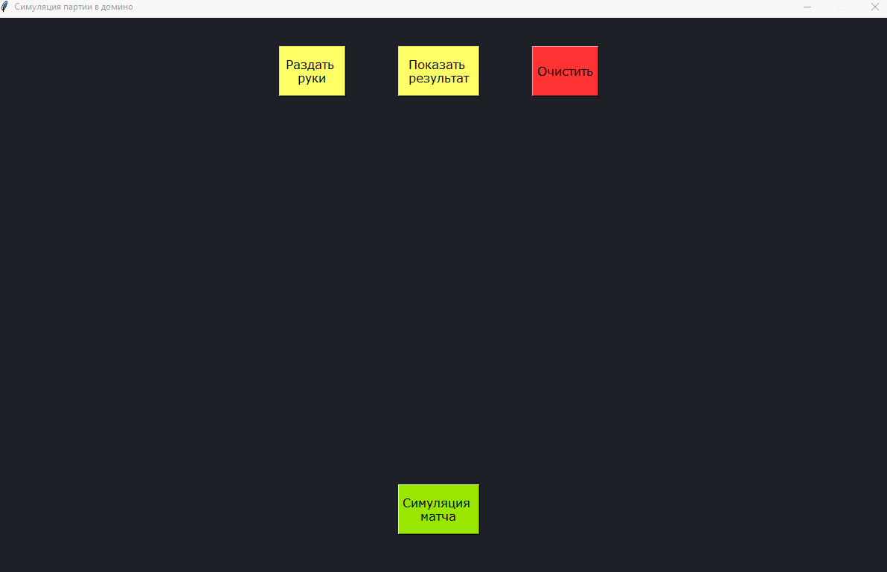

# Симуляция домино

Этот проект представляет из себя простой графический интерфейс, позволяющий наглядно проводить симуляцию игр и матчей в "козла". 

## Функционал

Интерфейс позволяет осуществлять действия двух видов:

* **Симуляция одной игры:** реализуется через последовательное нажатие кнопок *Раздать руки* и *Показать результат*. Первая сгенерирует начальную раздачу, а вторая покажет конец игры, а именно стол с результатами всех ходов и оставшиеся на руках у игроков фишки. 
* **Симуляция матча:** генерирует одиночные игры до тех пор, пока суммарные очки одного из игроков не превысят 101. После этого на экран выводится сводка по проведенной сессии, включающая очки, победы и количество прав первого хода каждого из игроков, общее количество игр и ничьих, а также номера проигравших.
 
## Правила и условности

Существует множество вариаций правил домино. По сути, любая компания играет так, как привыкла и как считает наиболее увлекательным. Создавая логику для игры, я выделил для себя ряд основополагающих условий, которые взял за основу в своей собственной версии:

1. В игре принимают участие 4 игрока, которые берут по 7 доминошек. Соответственно, все доминошки оказываются разобраны в самом начале и "базар" (колода, из которой можно добирать во время игры) отсутствует как таковой. В некоторых версиях игры при наличии более двух участников раздаются руки лишь по 5 фишек, однако я никогда не сталкивался с подобным и потому не считаю, что такой вариант чем-либо лучше.
2. Игру всегда начинает игрок с фишкой (6,6) на руках и начинает всегда с нее. Это правило тоже разнится от версии к версии: где-то напротив ход получает игрок с (1,1), где-то ход отдается игроку, следующему за раздающим.
3. По итогам каждой игры все игроки, кроме победителя, записывают на свой счет сумму оставшихся у них на руках очков. Порога, до которого очки не учитываются, в этой версии нет.
4. В случае "рыбы" (исхода вничью), всем игрокам также записываются оставшиеся у них очки. Никаких дополнительных привилегий у игрока, сделавшего последний ход, при таком раскладе не предусмотрено. 
5. Матч разыгрывается до 101 очка. После того, как один из игроков набирает столько или более, матч заканчивается, а этот игрок объявляется проигравшим. Если по итогам последней игры больше 101 очка оказывается сразу у нескольких игроков, проигравшими объявляются все они.
6. Симуляция устроена таким образом, что никто из игроков не имеет представления о тактических элементах игры. Поэтому каждый из них разыгрывает первую попавшуюся фишку из руки, если она подходит под расклад на столе. Можно назвать это недостатком, однако я убежден, что в реальности большинство игр проходит именно так. 

## Статистика

В дополнение к самому интерфейсу было проведено [небольшое исследование](https://github.com/Wishmas/Timofey_Vorovatov/blob/main/%D0%A1%D0%B8%D0%BC%D1%83%D0%BB%D1%8F%D1%86%D0%B8%D1%8F%20%D0%B4%D0%BE%D0%BC%D0%B8%D0%BD%D0%BE/statistics.ipynb), целью которого было рассмотреть распределения основных случайных величин, получающихся при большом количестве повторений эксперимента с симуляцией матча. Исследование также позволило убедиться, что симуляция действует "честно" и с равной частотой генерирует гипотетически равновероятные исходы. 

## Реализация 

Попробовать симуляцию в действии можно [здесь](https://github.com/Wishmas/Timofey_Vorovatov/releases/tag/v1.0). Для этого нужно лишь загрузить архив visual_implement.rar и запустить файл visual_implement.exe. 

